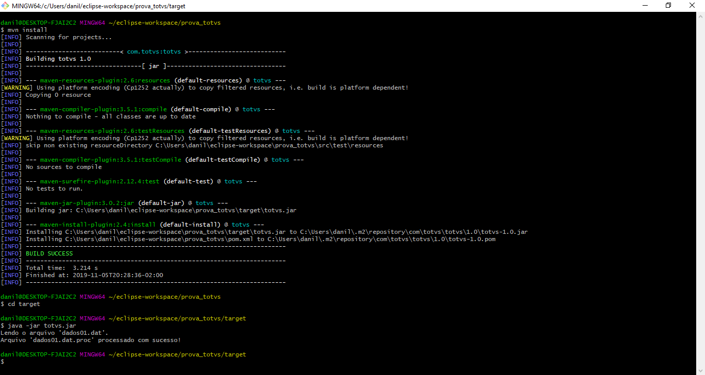

# Processador de Arquivos

Prova técnica Java enviada pela empresa TOTVS.

## Características

- Design Patterns
- Entity
- Service
- Factory

## Requisitos

- Java JDK 1.8
- Maven 3.5.4

## Tecnologias

- Java 8
- Maven

## Instalação

```
$ git clone https://github.com/danilomeneghel/prova_totvs.git

$ cd prova_totvs

```
Após baixar o projeto, copie a pasta "dados" para o C:\ do seu computador.
Depois abra o prompt de comando (cmd), entre no diretório do projeto e digite: <br>

```
$ mvn install
$ cd target
$ java -jar totvs.jar
```

Ou compile a classe Main e execute via prompt de comando: <br>

```
$ cd src\main\java 
$ javac Main.java
$ java Main
```

## Licença

Projeto licenciado sob <a href="LICENSE">The MIT License (MIT)</a>.

## Screenshots

<br><br>


Developed by<br>
Danilo Meneghel<br>
danilo.meneghel@gmail.com<br>
http://danilomeneghel.github.io/<br>
